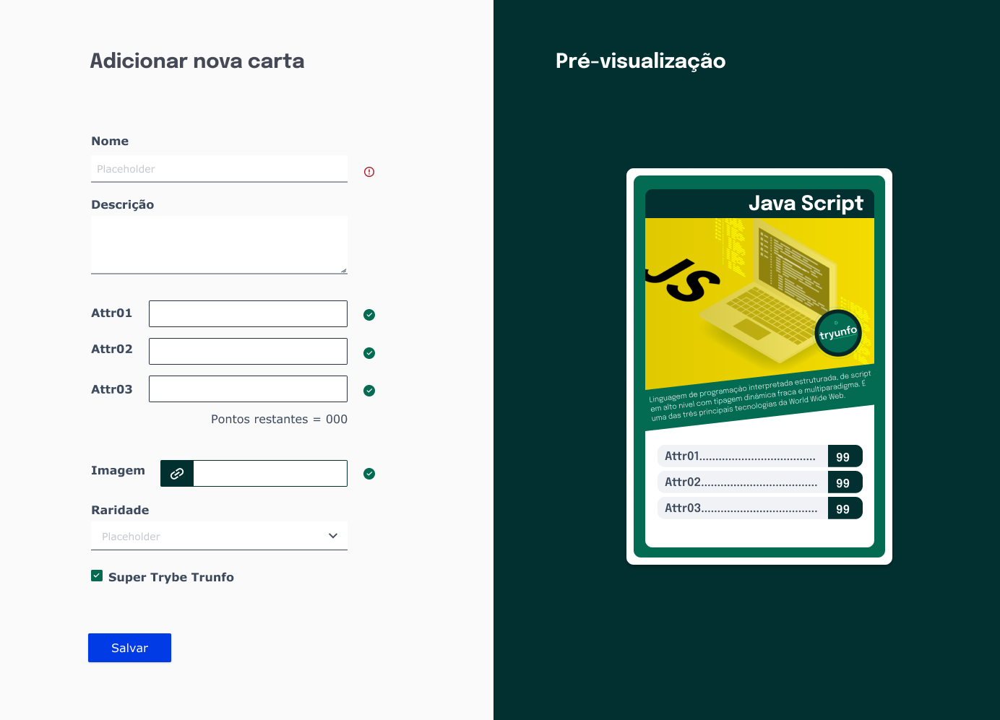

<p align="center">
  
</p>

## 📋 Sobre o projeto
Crie seus próprios cards personalizados



[](https://www.figma.com/file/psAYBgwjQ1pQqBe3wJvljt/Tryunfo?node-id=0%3A1&t=YpAWmlJfzdmWQJ54-1)
> estilização em andamento

## 💻 Tecnologias
- React

## ✨ Funcionalidades 
- Criar cards com texto, imagens e atributos personalizados
- Visualizar os cards
- Filtrar cards

## 🧠 Aprendizado
Neste projeto pude aprender a trabalhar com estados e eventos, assim como a utilizar formulários dentro do react

## 📦 Inicialização
```bash
npm i
```
```bash 
npm start
```
